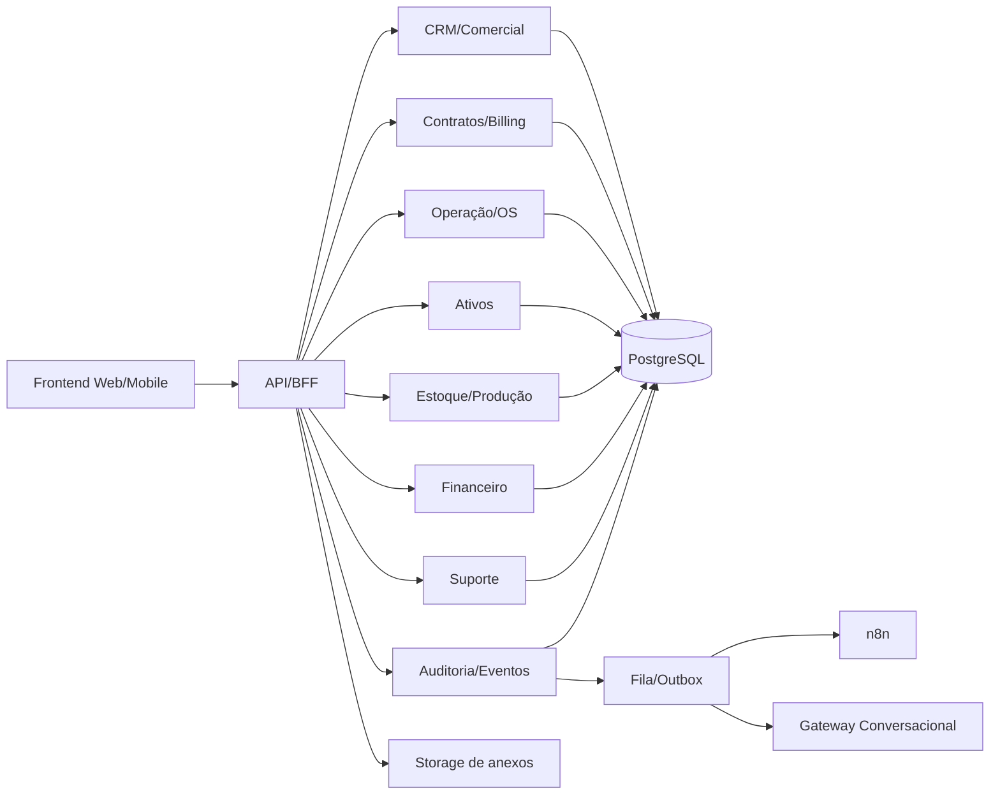

# GreenLink ADM v2

## Product Requirements Document (PRD)

**Versão:** 2.0  
**Status:** Proposto para aprovação  
**Data:** 2026-05-11  
**Produto:** GreenLink ADM  
**Tipo:** PRD + Plano Técnico de Implementação  
**Objetivo do documento:** servir como referência central para discovery, arquitetura, backlog, desenvolvimento, testes, implantação e operação inicial do produto.

---

## 1. Resumo executivo

O **GreenLink ADM** deve evoluir de um conjunto de fluxos operacionais parcialmente cobertos para um **ERP operacional verticalizado**, capaz de centralizar comercial, contratos, recorrência, ativos, operação de campo, estoque, produção, financeiro e suporte em uma única plataforma.

O PRD atual tem uma base estratégica forte: define corretamente o problema de negócio, prioriza domínios críticos e posiciona o produto como núcleo transacional do negócio. No entanto, quando comparado às melhores práticas de mercado em plataformas como **Jobber, Housecall Pro, ServiceM8, Odoo, ERPNext e sistemas de billing/field service modernos**, ainda faltam alguns elementos estruturantes para orientar um ciclo completo de desenvolvimento com previsibilidade técnica e operacional:

- definição explícita de metas mensuráveis por fase;
- critérios de aceitação detalhados por fluxo;
- requisitos não funcionais quantificados;
- estratégia de migração da planilha e do protótipo atual para produção;
- governança de dados, observabilidade e segurança operacional;
- visão clara de arquitetura-alvo versus estado atual do repositório;
- plano de rollout, riscos e dependências.

Este documento v2 resolve essas lacunas e estabelece uma base única para execução.

---

## 2. Contexto atual do produto e do repositório

### 2.1 Situação atual do negócio

Hoje a GreenLink depende de processos híbridos entre operação humana, histórico disperso e planilhas. Isso gera:

- retrabalho e dupla digitação;
- baixa confiabilidade do dado gerencial;
- dificuldade para rastrear contratos, ativos e cobranças;
- pouca previsibilidade de receita, inadimplência, margem e capacidade operacional;
- fragilidade para escalar suporte, campo e cobrança recorrente.

### 2.2 Situação atual da aplicação

O estado atual do repositório indica um **frontend funcional de validação**, com módulos já representados na interface, porém sustentados por **mocks persistidos em cliente**. Isso é útil para discovery, validação de UX e demonstração de fluxos, mas **não atende aos requisitos de produção** como sistema de verdade.

### 2.3 Leitura executiva do gap atual

**O que já existe conceitualmente:**

- CRM/comercial;
- pedidos e orçamentos;
- contratos, OS, ativos, estoque, financeiro e suporte em nível de interface;
- dashboards operacionais iniciais.

**O que ainda precisa existir para produção:**

- backend transacional real;
- banco de dados relacional com integridade;
- autenticação robusta e RBAC por permissão;
- trilha de auditoria confiável;
- engine de recorrência/cobrança;
- integração entre estoque, OS, contratos e financeiro;
- observabilidade;
- importação/migração de dados;
- testes automatizados e governança de deploy.

---

## 3. Análise comparativa do PRD atual vs melhores práticas de mercado

| Tema                  | PRD atual                 | Melhor prática de mercado                                       | Recomendação v2                                                       |
| --------------------- | ------------------------- | --------------------------------------------------------------- | --------------------------------------------------------------------- |
| Visão do produto      | Forte e bem posicionada   | Produto orientado a fluxo ponta a ponta                         | Manter visão central e explicitar jornada operacional-to-financeira   |
| Escopo funcional      | Abrangente                | Cobertura por domínios com contratos claros                     | Manter escopo, mas modularizar em capacidades e fluxos                |
| Priorização           | P0/P1/P2 bem definida     | Roadmap com milestones e critérios de go/no-go                  | Acrescentar milestones técnicos, dependências e gates                 |
| Comercial             | Bom foco em quote → order | Catálogo obrigatório, snapshot, SLA comercial, automações       | Formalizar regras de aprovação, versionamento e conversão             |
| Contratos/recorrência | Correto e core            | Billing engine, calendários, reajuste, suspensão, reativação    | Detalhar estados, regras e reconciliação financeira                   |
| Campo/OS              | Boa aderência             | Mobile-first, evidências, assinatura, offline parcial           | Incluir sincronização resiliente e regras de reabertura               |
| Ativos                | Bem posicionado           | Asset-centric service history                                   | Tornar ativo pivô de suporte, OS, contrato e custo                    |
| Estoque/produção      | Presente                  | Reserva, rastreabilidade, custo e disponibilidade em tempo real | Definir integrações transacionais mínimas no P0/P1                    |
| Financeiro            | Grande avanço no PRD      | AR/AP, fluxo de caixa, DRE, recorrência, conciliação            | Acrescentar eventos, status, aging e critérios contábeis operacionais |
| Suporte               | Evoluiu corretamente      | Ticketing separado de execução                                  | Formalizar SLA, fila, triagem e handoff para campo                    |
| NFRs                  | Genéricos                 | SLOs mensuráveis e requisitos auditáveis                        | Quantificar performance, disponibilidade, restore e segurança         |
| Arquitetura           | Boa direção               | Núcleo transacional, eventos, integrações desacopladas          | Ajustar para a realidade do repositório atual e plano de migração     |
| Go-live               | Pouco detalhado           | Rollout progressivo e migração assistida                        | Incluir cutover, paralelismo controlado e plano de contingência       |

### 3.1 Conclusão comparativa

O PRD atual está **acima da média em visão de negócio e cobertura funcional**, mas ainda está **abaixo do ideal em governança de entrega**. A principal evolução necessária não é ampliar mais escopo, e sim **transformar escopo em execução operacional e técnica controlada**.

---

## 4. Visão geral do produto

### 4.1 Visão

O GreenLink ADM será o sistema operacional central da GreenLink para gestão integrada de:

- comercial;
- contratos e recorrência;
- operação de campo;
- ativos instalados e locados;
- catálogo, estoque e produção;
- financeiro e controladoria;
- suporte, automação e inteligência operacional.

### 4.2 Proposta de valor

Centralizar todo o ciclo operacional e administrativo em uma única plataforma, eliminando a dependência da planilha como fonte primária de gestão e criando rastreabilidade fim a fim do negócio.

### 4.3 Fluxo operacional central

`lead → orçamento → pedido/contrato → agendamento/OS → instalação/suporte → ativo em campo → cobrança/financeiro → histórico → indicadores`

### 4.4 Princípios do produto

- **Single source of truth:** o sistema deve ser a fonte primária de operação.
- **Catálogo antes de texto livre:** itens, serviços e contratos devem ser estruturados.
- **Evento antes de planilha:** mudanças críticas precisam gerar histórico auditável.
- **Operação orientada a entidade:** cliente, contrato, ativo, OS e cobrança devem ser rastreáveis.
- **Arquitetura desacoplada:** o ERP operacional é o núcleo; automações e IA orbitam o core.
- **Entrega incremental:** priorizar valor real sem comprometer integridade futura.

---

## 5. Objetivos de negócio

### 5.1 Objetivos estratégicos

1. Substituir a planilha operacional/financeira como ferramenta principal de gestão.
2. Unificar comercial, operação, contratos e financeiro em uma plataforma única.
3. Aumentar previsibilidade de receita, inadimplência, custo e margem.
4. Melhorar governança, auditoria e qualidade de dados.
5. Preparar o ambiente para automações e operação conversacional futura.

### 5.2 Resultados esperados

| Objetivo                      | Resultado esperado                                                  |
| ----------------------------- | ------------------------------------------------------------------- |
| Eliminar retrabalho           | redução de digitação duplicada e reconciliação manual               |
| Melhorar gestão financeira    | visão confiável de contas a receber, a pagar, fluxo e inadimplência |
| Aumentar controle operacional | rastreabilidade por cliente, contrato, ativo e OS                   |
| Ganhar eficiência de campo    | melhor agendamento, evidências e histórico técnico                  |
| Melhorar suporte              | separação entre triagem, ticket e execução                          |
| Aumentar escalabilidade       | operação com papéis, permissões, eventos e integrações              |

### 5.3 Metas de negócio sugeridas para os 6 primeiros meses pós-go-live

| Métrica                                            | Meta                 |
| -------------------------------------------------- | -------------------- |
| Processos saídos da planilha                       | >= 80% dos fluxos P0 |
| Contratos ativos cadastrados na plataforma         | >= 95%               |
| Recebíveis gerados automaticamente por recorrência | >= 90%               |
| OS com evidência digital completa                  | >= 85%               |
| Redução do retrabalho operacional                  | >= 40%               |
| Visibilidade diária de inadimplência               | 100%                 |
| Usuários ativos semanais dos perfis-chave          | >= 85%               |

---

## 6. Escopo do produto

### 6.1 Em escopo

1. CRM e Comercial
2. Contratos, Locação e Recorrência
3. Operação de Campo, Agenda e OS
4. Ativos Instalados e Locados
5. Catálogo, Estoque e Produção
6. Financeiro e Controladoria
7. Suporte e Atendimento
8. Auditoria, Eventos e Anexos
9. Permissões, segurança e observabilidade
10. Integrações e automações desacopladas

### 6.2 Fora de escopo inicial

- marketplace;
- app nativo separado;
- contabilidade fiscal completa;
- roteirização geográfica avançada;
- CRM de marketing completo;
- precificação dinâmica complexa;
- multiempresa/franquias no P0.

---

## 7. Perfis de usuário e permissões

### 7.1 Perfis principais

- **Admin**
- **Comercial**
- **Financeiro**
- **Operação**
- **Técnico de campo**
- **Gestão / leitura**
- **Parceiro externo** (futuro)

### 7.2 Diretriz de autorização

O produto deve adotar **RBAC + permissões granulares por ação**, evitando dependência exclusiva do papel macro.

### 7.3 Exemplos de permissões

- visualizar cliente;
- editar cliente;
- aprovar orçamento;
- converter orçamento em pedido;
- gerar contrato;
- suspender contrato;
- agendar OS;
- concluir OS;
- consumir item de estoque;
- lançar recebimento;
- lançar despesa;
- cancelar cobrança;
- exportar relatórios;
- excluir anexos;
- visualizar margem;
- configurar categorias financeiras.

---

## 8. Entidades centrais do domínio

### 8.1 Entidades macro

**Comercial**

- lead
- customer
- contact
- opportunity
- quote
- quote_item
- price_book

**Pedido e contratos**

- order
- order_item
- contract
- contract_item
- subscription_plan
- billing_cycle
- rental_contract
- rental_asset_allocation
- deposit
- renewal_event

**Operação de campo**

- service_order
- service_visit
- technician
- route_window
- checklist
- service_attachment
- service_material_usage

**Ativos**

- asset
- asset_model
- asset_event
- serial_number
- installation_record
- maintenance_record
- devolution_record

**Catálogo, estoque e produção**

- product
- service
- warehouse
- stock_movement
- inventory_balance
- kit_composition
- bom
- bom_item
- production_order
- production_batch
- production_cost

**Financeiro**

- receivable
- receivable_installment
- payable
- expense
- cash_entry
- financial_category
- cost_center
- commission
- invoice_record
- contract_billing

**Suporte e auditoria**

- support_ticket
- ticket_comment
- ticket_category
- ticket_priority
- sla_policy
- resolution_type
- audit_log
- domain_event
- outbox_event
- attachment

### 8.2 Entidades pivô do produto

As entidades com maior impacto transversal são:

- **customer**
- **contract**
- **asset**
- **service_order**
- **receivable**
- **support_ticket**

Essas entidades devem possuir histórico, anexos, auditoria e relacionamentos explícitos.

---

## 9. Requisitos funcionais

## 9.1 CRM e Comercial

### Requisitos

- **RF-CRM-01:** cadastrar leads, clientes e contatos.
- **RF-CRM-02:** registrar origem do lead, responsável e histórico de interação.
- **RF-CRM-03:** operar pipeline comercial por estágio.
- **RF-CRM-04:** gerar orçamento baseado em catálogo.
- **RF-CRM-05:** congelar preço, desconto e condições no snapshot do orçamento.
- **RF-CRM-06:** aprovar orçamento por workflow interno configurável.
- **RF-CRM-07:** converter orçamento aprovado em pedido ou contrato.
- **RF-CRM-08:** medir conversão por etapa, origem e responsável.
- **RF-CRM-09:** manter trilha de mudanças de estágio e aprovações.

### Regras

- orçamento não pode depender de descrição livre como fluxo principal;
- orçamento aprovado não pode ser alterado sem versionamento;
- pedido deve preservar vínculo com orçamento de origem;
- cancelamento deve manter histórico, sem exclusão lógica destrutiva.

---

## 9.2 Contratos, Locação e Recorrência

### Requisitos

- **RF-CON-01:** criar contrato avulso, recorrente, locação ou misto.
- **RF-CON-02:** definir itens contratuais com vigência, preço, periodicidade e regras.
- **RF-CON-03:** gerar calendário de cobrança por ciclo.
- **RF-CON-04:** controlar início, suspensão, reativação, encerramento e renovação.
- **RF-CON-05:** vincular ativos locados ao contrato.
- **RF-CON-06:** registrar caução/depósito.
- **RF-CON-07:** aplicar reajuste com histórico.
- **RF-CON-08:** gerar recebíveis automaticamente por recorrência.
- **RF-CON-09:** impedir inconsistência entre contrato ativo e faturamento suspenso sem motivo registrado.

### Regras

- todo contrato deve ter status claro e auditável;
- alteração de valor/frequência deve gerar versionamento;
- contratos recorrentes devem gerar eventos de billing;
- renovação automática deve respeitar antecedência e regras configuradas.

---

## 9.3 Operação de Campo, Agenda e OS

### Requisitos

- **RF-OS-01:** criar OS por instalação, manutenção, retirada, suporte ou vistoria.
- **RF-OS-02:** vincular OS a cliente, contrato, pedido e ativo.
- **RF-OS-03:** agendar por técnico, janela e região.
- **RF-OS-04:** controlar status operacionais padronizados.
- **RF-OS-05:** executar checklist por tipo de serviço.
- **RF-OS-06:** anexar fotos, documentos e evidências.
- **RF-OS-07:** coletar assinatura do cliente quando aplicável.
- **RF-OS-08:** registrar deslocamento, chegada, início e conclusão.
- **RF-OS-09:** registrar consumo de material.
- **RF-OS-10:** permitir reabertura controlada com auditoria.
- **RF-OS-11:** disponibilizar visão calendário/board por técnico e região.
- **RF-OS-12:** permitir operação mobile-first, com tolerância a conectividade instável.

### Status mínimos

- pendente
- agendada
- em deslocamento
- em atendimento
- aguardando peça
- concluída
- cancelada
- retorno necessário

---

## 9.4 Ativos Instalados e Locados

### Requisitos

- **RF-ATV-01:** cadastrar ativos por modelo, categoria e número de série.
- **RF-ATV-02:** identificar origem do ativo: comprado, fabricado, alugado ou emprestado.
- **RF-ATV-03:** vincular ativo a cliente, contrato, pedido e instalação.
- **RF-ATV-04:** manter histórico técnico e financeiro por ativo.
- **RF-ATV-05:** registrar eventos: instalação, troca, manutenção, retirada, devolução e baixa.
- **RF-ATV-06:** controlar status operacional do ativo.
- **RF-ATV-07:** localizar rapidamente ativos por cliente, serial, tag e status.

### Regra estrutural

Todo ativo relevante deve possuir identidade rastreável, inclusive quando fizer parte de kit.

---

## 9.5 Catálogo, Estoque e Produção

### Catálogo

- **RF-CAT-01:** manter catálogo unificado de produtos, serviços, kits, itens fabricados, locáveis e consumíveis.
- **RF-CAT-02:** permitir ativação/inativação controlada.
- **RF-CAT-03:** versionar preço e atributos relevantes.

### Estoque

- **RF-EST-01:** controlar saldo por almoxarifado/local.
- **RF-EST-02:** registrar entrada, saída, reserva, transferência e ajuste.
- **RF-EST-03:** rastrear itens serializados e lotes quando aplicável.
- **RF-EST-04:** reservar itens a partir de pedido ou OS.
- **RF-EST-05:** dar baixa de consumo em instalação/manutenção.
- **RF-EST-06:** alertar indisponibilidade e estoque crítico.

### Produção

- **RF-PROD-01:** manter BOM/lista técnica.
- **RF-PROD-02:** abrir ordem de produção.
- **RF-PROD-03:** consumir componentes.
- **RF-PROD-04:** registrar lote produzido e custo.
- **RF-PROD-05:** movimentar item acabado para estoque.

---

## 9.6 Financeiro e Controladoria

### Requisitos

- **RF-FIN-01:** gerenciar contas a receber.
- **RF-FIN-02:** gerenciar contas a pagar.
- **RF-FIN-03:** registrar despesas avulsas e recorrentes.
- **RF-FIN-04:** gerar parcelas por pedido e contrato.
- **RF-FIN-05:** controlar vencimento, pagamento, inadimplência e estorno.
- **RF-FIN-06:** registrar categorias financeiras e centros de custo.
- **RF-FIN-07:** calcular fluxo de caixa previsto e realizado.
- **RF-FIN-08:** suportar DRE gerencial.
- **RF-FIN-09:** medir receita por linha de negócio.
- **RF-FIN-10:** medir margem por produto, serviço e contrato.
- **RF-FIN-11:** calcular comissões por regra configurável.
- **RF-FIN-12:** suportar aging de recebíveis e visão de inadimplência.

### Regras

- financeiro não pode depender de status manual no pedido;
- cobranças recorrentes devem ser geradas por ciclo contratual;
- custos e despesas devem alimentar visão gerencial;
- recebimento parcial, estorno e renegociação devem ficar preparados no modelo.

---

## 9.7 Suporte e Atendimento

### Requisitos

- **RF-SUP-01:** abrir ticket de suporte por múltiplos canais.
- **RF-SUP-02:** classificar por categoria, prioridade e SLA.
- **RF-SUP-03:** registrar comentários internos e externos.
- **RF-SUP-04:** vincular ticket a cliente, contrato, ativo e OS.
- **RF-SUP-05:** encaminhar ticket para OS quando houver visita técnica.
- **RF-SUP-06:** registrar resolução, causa raiz e desfecho.
- **RF-SUP-07:** medir tempo de primeira resposta, resolução e cumprimento de SLA.

---

## 9.8 Auditoria, Eventos e Anexos

### Requisitos

- **RF-AUD-01:** registrar ator, ação, entidade, antes/depois, timestamp e metadata.
- **RF-AUD-02:** padronizar eventos de domínio.
- **RF-AUD-03:** suportar outbox events para integrações.
- **RF-AUD-04:** armazenar anexos com tipo, tamanho, hash, autor, origem e vínculo.
- **RF-AUD-05:** definir retenção e organização lógica de storage.
- **RF-AUD-06:** permitir consulta de histórico por entidade e por usuário.

### Eventos mínimos

- orçamento criado;
- orçamento aprovado;
- pedido gerado;
- contrato ativado;
- ativo reservado;
- OS concluída;
- parcela vencida;
- pagamento registrado;
- ticket resolvido.

---

## 10. Casos de uso detalhados

### UC-01: Lead até orçamento aprovado

**Objetivo:** converter oportunidade comercial em orçamento formal.  
**Atores:** Comercial, Gestão.  
**Pré-condições:** cliente/lead cadastrado; catálogo ativo; usuário autenticado.  
**Fluxo principal:**

1. Comercial cadastra lead ou converte para cliente.
2. Cria oportunidade com estágio e valor estimado.
3. Seleciona itens do catálogo para compor orçamento.
4. Sistema congela preço e condições.
5. Usuário submete orçamento para aprovação.
6. Aprovador aprova ou solicita ajuste.
7. Sistema registra histórico e status final.
   **Pós-condições:** orçamento aprovado e elegível para conversão.  
   **Exceções:** item inativo; preço indisponível; falta de permissão.

### UC-02: Orçamento aprovado para pedido e contrato

**Objetivo:** formalizar compromisso comercial e estruturar faturamento.  
**Atores:** Comercial, Operação, Financeiro.  
**Pré-condições:** orçamento aprovado.  
**Fluxo principal:**

1. Usuário converte orçamento em pedido.
2. Sistema cria pedido preservando snapshot.
3. Se houver recorrência ou locação, usuário gera contrato.
4. Sistema cria calendário de cobrança e status inicial.
5. Pedido e contrato ficam vinculados ao cliente e aos itens.
   **Pós-condições:** pedido ativo e contrato pronto para operação/cobrança.  
   **Exceções:** contrato sem regra de billing; itens sem parametrização.

### UC-03: Geração de cobrança recorrente

**Objetivo:** criar recebíveis automaticamente a partir de contratos ativos.  
**Atores:** Financeiro, Sistema.  
**Pré-condições:** contrato ativo com ciclo e regra de cobrança definidos.  
**Fluxo principal:**

1. Rotina identifica contratos faturáveis no período.
2. Sistema gera parcelas/recebíveis.
3. Financeiro revisa exceções, se existirem.
4. Cobranças passam a compor fluxo de caixa e aging.
   **Pós-condições:** recebíveis gerados e auditados.  
   **Exceções:** contrato suspenso; item sem preço vigente; duplicidade de ciclo.

### UC-04: Agendamento e execução de OS

**Objetivo:** executar instalação, manutenção ou atendimento de campo.  
**Atores:** Operação, Técnico de campo, Cliente.  
**Pré-condições:** pedido/contrato elegível; técnico disponível.  
**Fluxo principal:**

1. Operação cria e agenda OS.
2. Sistema vincula cliente, técnico, ativos e materiais.
3. Técnico inicia deslocamento e atendimento.
4. Executa checklist, registra evidências e consumo.
5. Coleta assinatura do cliente, quando aplicável.
6. Conclui atendimento.
7. Sistema atualiza histórico do ativo e eventos relacionados.
   **Pós-condições:** OS concluída com evidências e trilha auditável.  
   **Exceções:** falta de material; necessidade de retorno; falha de conectividade.

### UC-05: Alocação e ciclo de vida do ativo

**Objetivo:** garantir rastreabilidade do ativo da origem até a retirada.  
**Atores:** Operação, Estoque, Técnico, Financeiro.  
**Pré-condições:** ativo cadastrado e disponível.  
**Fluxo principal:**

1. Ativo é reservado a pedido/contrato.
2. Sai do estoque ou status disponível para reservado.
3. Após instalação, status muda para instalado/locado.
4. Eventos técnicos e financeiros ficam vinculados.
5. Em retirada/devolução, sistema encerra vínculo com cliente.
   **Pós-condições:** histórico consolidado do ativo.  
   **Exceções:** serial duplicado; ativo indisponível; divergência de status.

### UC-06: Ticket de suporte com conversão para OS

**Objetivo:** separar triagem de suporte da execução técnica.  
**Atores:** Suporte, Operação, Técnico.  
**Pré-condições:** cliente identificado; canal de entrada disponível.  
**Fluxo principal:**

1. Suporte abre ticket e classifica prioridade.
2. Analista registra diagnóstico inicial.
3. Se necessário, converte ticket em OS.
4. Operação agenda visita.
5. Após execução, ticket recebe resolução final.
   **Pós-condições:** ticket encerrado com causa raiz e vínculo da OS.  
   **Exceções:** SLA expirado; cliente não responde; OS cancelada.

### UC-07: Reserva de estoque e consumo em serviço

**Objetivo:** sincronizar operação de campo e estoque.  
**Atores:** Operação, Estoque, Técnico.  
**Pré-condições:** item cadastrado; saldo disponível ou política de exceção.  
**Fluxo principal:**

1. OS ou pedido solicita reserva.
2. Sistema valida disponibilidade.
3. Estoque reserva item.
4. Técnico consome material durante execução.
5. Sistema baixa saldo e registra custo operacional.
   **Pós-condições:** saldo atualizado e consumo rastreado.  
   **Exceções:** saldo insuficiente; material substituto; ajuste manual autorizado.

### UC-08: Fechamento gerencial financeiro

**Objetivo:** fornecer visão confiável de caixa, inadimplência e margem.  
**Atores:** Financeiro, Gestao.  
**Pré-condições:** lançamentos categorizados e contratos/pedidos vinculados.  
**Fluxo principal:**

1. Recebimentos e pagamentos são registrados.
2. Sistema recalcula aging, fluxo e projeções.
3. Gestão acessa dashboards de receita, custo e margem.
4. Exceções são tratadas por categoria, contrato ou centro de custo.
   **Pós-condições:** visão gerencial consolidada e auditável.  
   **Exceções:** categorias incompletas; lançamentos sem vínculo; inconsistências de origem.

---

## 11. Requisitos não funcionais

### 11.1 Segurança

- autenticação segura com suporte a MFA no roadmap;
- RBAC por papel e permissão;
- logs de acesso e trilha de auditoria em ações críticas;
- segregação de ambientes;
- criptografia em trânsito e em repouso;
- política de segredo e rotação de chaves;
- proteção contra acesso indevido a anexos.

### 11.2 Performance

- p95 de leitura de telas transacionais <= 2s em condições normais;
- p95 de ações críticas <= 3s, exceto exportações e jobs assíncronos;
- listas operacionais com paginação, filtros e ordenação server-side;
- exportações e rotinas de billing executadas de forma assíncrona.

### 11.3 Confiabilidade

- disponibilidade alvo de 99,5% no go-live e 99,9% após estabilização;
- backups automáticos diários;
- RPO <= 24h no início, evoluindo para <= 4h;
- RTO <= 8h no início, evoluindo para <= 2h;
- fila resiliente para eventos críticos;
- idempotência em rotinas de cobrança e integrações.

### 11.4 Usabilidade

- desktop-first para administrativo;
- mobile-first para técnico de campo;
- formulários enxutos;
- feedback claro de status e erro;
- busca rápida por cliente, contrato, ativo e OS;
- UX consistente para filtros, histórico e anexos.

### 11.5 Observabilidade

- logs estruturados por correlação;
- monitoramento de API, jobs, filas e banco;
- alertas para falhas de billing, erro de integração e degradação;
- dashboards operacionais e técnicos separados.

### 11.6 Escalabilidade e manutenção

- arquitetura modular por domínio;
- contratos de API estáveis;
- versionamento de eventos;
- cobertura mínima de testes por camada;
- documentação técnica contínua.

### 11.7 Compliance e governança

- aderência à LGPD para dados pessoais;
- política de retenção de anexos e auditoria;
- mascaramento de dados sensíveis quando necessário;
- rastreabilidade de ações administrativas.

---

## 12. Arquitetura do sistema

## 12.1 Diretriz arquitetural

O GreenLink ADM deve adotar um **núcleo transacional próprio**, com automações, integrações e camada conversacional desacopladas. O sistema operacional nunca deve delegar regras centrais de negócio a ferramentas periféricas.

## 12.2 Leitura da arquitetura atual

O repositório atual é adequado como **protótipo navegável** e base de UX, mas não como sistema produtivo. A principal decisão técnica recomendada é:

- **preservar o frontend atual como base de interface**, evitando rewrite desnecessário;
- **introduzir backend modular real e banco transacional**;
- **substituir gradualmente mocks locais por APIs e persistência confiável**.

## 12.3 Arquitetura-alvo recomendada

### Camadas

1. **Frontend web**
   - React/TanStack Start atual ou camada web equivalente
   - foco em backoffice desktop e operação mobile responsiva

2. **Backend/BFF e serviços de domínio**
   - Node.js/TypeScript
   - APIs por domínio
   - validação de regras, permissões e workflows

3. **Banco transacional**
   - PostgreSQL
   - modelagem relacional orientada a integridade e auditoria

4. **Storage**
   - S3 compatível para anexos/evidências

5. **Mensageria e eventos**
   - fila simples + outbox pattern
   - webhooks de domínio

6. **Automação**
   - n8n self-hosted para orquestrações não críticas

7. **Camada conversacional**
   - gateway separado, consumindo APIs/eventos, sem virar sistema de verdade

## 12.4 Domínios sugeridos

- IAM e Permissões
- CRM/Comercial
- Pedidos
- Contratos e Billing
- Operação de Campo
- Ativos
- Catálogo/Estoque/Produção
- Financeiro/Controladoria
- Suporte
- Auditoria e Eventos

## 12.5 Fluxo lógico simplificado

## 12.6 Diretrizes técnicas obrigatórias

- APIs autenticadas e autorizadas por permissão;
- operações críticas transacionais;
- eventos publicados via outbox;
- jobs idempotentes;
- modelagem preparada para soft delete e auditoria;
- anexos desacoplados do banco relacional;
- separação clara entre leitura operacional e processamento assíncrono.

## 12.7 Estratégia de evolução a partir do protótipo atual

### Etapa 1

Transformar o modelo atual de mocks em contratos de domínio formais.

### Etapa 2

Criar banco, ORM e APIs para entidades centrais.

### Etapa 3

Substituir rotas do frontend para consumir APIs reais por módulo.

### Etapa 4

Introduzir autenticação, RBAC, auditoria e importação inicial.

### Etapa 5

Ativar billing, estoque transacional, dashboards reais e cutover.

---

## 13. Critérios de aceitação

## 13.1 Critérios gerais de produto

- nenhum fluxo P0 crítico depende de planilha para fechar operação;
- todas as entidades centrais possuem histórico, status e vínculos rastreáveis;
- usuários só executam ações compatíveis com suas permissões;
- operações financeiras derivadas de contratos são geradas automaticamente;
- OS concluídas mantêm evidência e histórico;
- dados operacionais alimentam dashboards gerenciais confiáveis;
- logs e auditoria cobrem ações críticas.

## 13.2 Critérios de aceitação por domínio

### Comercial

- orçamento só nasce de catálogo;
- aprovação fica registrada com ator e timestamp;
- conversão para pedido preserva snapshot original.

### Contratos

- contrato ativo gera calendário de cobrança;
- suspensão bloqueia faturamento futuro quando aplicável;
- renovação e reajuste geram histórico.

### Campo/OS

- OS não pode ser concluída sem status final válido;
- evidências e checklist ficam vinculados;
- consumo de material impacta estoque quando configurado.

### Ativos

- cada ativo relevante possui identificador único;
- eventos do ativo são consultáveis por histórico.

### Estoque

- toda movimentação altera saldo e gera rastreabilidade;
- reserva e consumo mantêm vínculo com origem operacional.

### Financeiro

- cobrança recorrente gera recebíveis sem duplicidade;
- inadimplência é calculada automaticamente;
- fluxo previsto e realizado podem ser comparados.

### Suporte

- ticket possui prioridade, SLA e histórico;
- conversão em OS mantém vínculo entre atendimento e execução.

---

## 14. Roadmap de implementação

## 14.1 Estratégia de entrega

A implementação será feita por **ondas incrementais**, com prioridade em substituir a planilha nos fluxos críticos e reduzir risco de adoção.

## 14.2 Milestones

### M0 — Fundação e desenho detalhado

**Objetivo:** preparar base técnica e de produto.  
**Entregas:**

- refinamento do modelo de domínio;
- mapeamento da planilha atual e regras reais;
- backlog priorizado por fluxo;
- arquitetura de produção validada;
- estratégia de migração de dados;
- política de RBAC inicial;
- definição de KPIs e eventos de domínio.

**Saída esperada:** blueprint técnico aprovado.

### M1 — Plataforma base

**Objetivo:** criar fundação produtiva.  
**Entregas:**

- banco PostgreSQL;
- ORM e migrations;
- autenticação e autorização;
- auditoria básica;
- estrutura de APIs;
- storage de anexos;
- observabilidade mínima;
- ambiente dev/homolog/prod.

**Go/No-Go:** base pronta para sustentar módulos reais.

### M2 — Comercial e pedidos

**Objetivo:** colocar CRM/comercial em produção controlada.  
**Entregas:**

- leads, clientes, contatos e pipeline;
- catálogo comercial;
- orçamento com snapshot;
- workflow de aprovação;
- pedido derivado de orçamento;
- dashboards comerciais básicos.

**Go/No-Go:** comercial deixa de depender de planilha.

### M3 — Contratos, billing, ativos e OS básica

**Objetivo:** conectar venda, contrato e operação.  
**Entregas:**

- contratos avulsos/recorrentes/locação;
- geração inicial de cobrança recorrente;
- cadastro de ativos;
- OS com agenda básica;
- histórico por ativo;
- anexos e evidências.

**Go/No-Go:** operação ponta a ponta cliente → contrato → OS funciona.

### M4 — Financeiro P0 e estoque transacional

**Objetivo:** substituir planilha financeira operacional.  
**Entregas:**

- contas a receber;
- contas a pagar;
- despesas;
- fluxo de caixa;
- estoque com entrada/saída/reserva;
- vínculo pedido/OS/financeiro/estoque;
- dashboards operacionais e financeiros P0.

**Go/No-Go:** planilha deixa de ser fonte primária financeira operacional.

### M5 — Hardening, migração e go-live

**Objetivo:** estabilizar e entrar em operação real.  
**Entregas:**

- importação assistida de dados;
- UAT com usuários-chave;
- treinamento por perfil;
- plano de contingência;
- correções de performance e segurança;
- monitoramento ativo;
- go-live progressivo.

**Go/No-Go:** operação real controlada por área.

### M6 — Consolidação P1

**Objetivo:** ganhar eficiência e maturidade operacional.  
**Entregas:**

- dispatch avançado;
- checklists por tipo;
- assinatura do cliente;
- suporte com SLA;
- comissões;
- centros de custo;
- DRE gerencial;
- produção simplificada;
- PWA de campo;
- webhooks e integrações.

### M7 — Diferenciação P2

**Objetivo:** escalar e diferenciar.  
**Entregas:**

- portal do cliente;
- autoatendimento;
- BI avançado;
- agenda inteligente;
- forecast;
- IA operacional;
- portal/parceiro;
- automação omnichannel.

---

## 15. Plano técnico de implementação

## 15.1 Estratégia de build

### Fase A — Descoberta e estabilização do modelo

- mapear regras reais da planilha;
- confirmar dicionário de dados;
- fechar estados e transições por entidade;
- priorizar integrações mínimas.

### Fase B — Core transacional

- modelagem relacional;
- migrations;
- serviços de domínio;
- API contracts;
- auditoria e eventos.

### Fase C — Migração do frontend

- trocar store local por camada de dados remota;
- manter UX atual sempre que possível;
- reimplementar módulo a módulo;
- usar feature flags por rota/domínio.

### Fase D — Dados e operação

- importar cadastros mestres;
- importar contratos/ativos/financeiro;
- reconciliar inconsistências;
- operar em paralelo por janela curta e controlada.

### Fase E — Operação assistida

- monitorar erros, filas e uso;
- coletar feedback por perfil;
- corrigir gaps antes de ampliar escopo.

## 15.2 Estratégia de dados

- definir identificadores únicos por entidade;
- criar tabelas de referência e histórico;
- suportar importação CSV/planilha assistida;
- manter trilha de origem do dado migrado;
- validar integridade antes do go-live.

## 15.3 Estratégia de testes

- testes unitários de regras de domínio;
- testes de integração de APIs;
- testes E2E dos fluxos críticos;
- smoke tests pós-deploy;
- UAT com cenários reais por área.

## 15.4 Estratégia de rollout

- piloto com usuários-chave;
- ativação por domínio ou área;
- janela de paralelismo limitada com planilha;
- congelamento de planilha na virada;
- suporte intensivo na primeira semana.

---

## 16. Riscos e mitigações

| Risco                                           | Impacto | Probabilidade | Mitigação                                                           |
| ----------------------------------------------- | ------- | ------------- | ------------------------------------------------------------------- |
| Escopo excessivo no P0                          | alto    | alto          | limitar P0 ao que substitui a planilha nos fluxos críticos          |
| Divergência entre protótipo e arquitetura final | alto    | médio         | formalizar contratos de domínio antes da implementação              |
| Migração de dados inconsistente                 | alto    | alto          | mapear planilha, validar amostras e executar importação assistida   |
| Dependência de regras tácitas do time           | alto    | alto          | discovery com usuários-chave e documentação por fluxo               |
| Falhas em billing recorrente                    | alto    | médio         | jobs idempotentes, logs, reconciliação e monitoração                |
| Adoção baixa pelos usuários                     | alto    | médio         | treinamento por perfil, rollout progressivo e UX orientada à rotina |
| Permissões mal definidas                        | médio   | médio         | matriz RBAC antes do go-live                                        |
| Integrações futuras acopladas ao core           | médio   | médio         | eventos via outbox e APIs estáveis                                  |
| Performance degradada em listas e dashboards    | médio   | médio         | paginação, índices e queries server-side                            |
| Reescrita desnecessária do frontend             | médio   | médio         | reaproveitar base atual e migrar incrementalmente                   |

---

## 17. Métricas de sucesso e KPIs

## 17.1 Operação

- % de OS concluídas no prazo
- tempo médio de atendimento
- taxa de revisita/retorno
- tempo médio entre criação e agendamento
- produtividade por técnico

## 17.2 Comercial

- taxa de conversão por estágio
- ciclo lead → orçamento
- ciclo orçamento → pedido
- ticket médio
- receita por vendedor/canal

## 17.3 Contratos e recorrência

- contratos ativos por tipo
- % de contratos com billing automatizado
- taxa de renovação
- churn contratual
- reajustes executados no prazo

## 17.4 Financeiro

- inadimplência total e por aging
- recebimento realizado vs previsto
- prazo médio de recebimento
- caixa projetado vs realizado
- margem por contrato/produto/servico

## 17.5 Suporte

- tempo de primeira resposta
- SLA cumprido
- taxa de resolução no primeiro atendimento
- tickets convertidos em OS
- recorrência por causa raiz

## 17.6 Adoção

- % de processos saídos da planilha
- % de usuários ativos por perfil
- % de contratos migrados
- % de ativos migrados
- taxa de uso das funcionalidades críticas

## 17.7 Saúde técnica

- disponibilidade
- taxa de erro por serviço
- tempo médio de resposta
- falhas em jobs críticos
- tempo de recuperação de incidente

---

## 18. Dependências e premissas

### Dependências

- disponibilidade dos responsáveis de negócio para discovery;
- acesso às planilhas atuais e regras de cálculo;
- definição de papéis e aprovadores;
- ambiente de infraestrutura mínimo;
- decisão sobre ferramenta de autenticação e storage.

### Premissas

- o protótipo atual será tratado como base de UX, não como core produtivo;
- o P0 não contemplará contabilidade fiscal completa;
- automações e IA não substituirão o sistema transacional;
- a equipe aceitará rollout incremental por domínio.

---

## 19. Veredito executivo

O GreenLink ADM v2 deve ser executado como um **ERP operacional verticalizado**, e não apenas como um CRM com OS. O valor estratégico do produto está em unir:

- comercial disciplinado;
- contratos e recorrência;
- operação de campo;
- rastreabilidade de ativos;
- estoque e produção;
- financeiro gerencial;
- auditoria e governança;
- automação desacoplada;
- base pronta para IA e canais conversacionais.

A recomendação final é:

1. **manter a visão funcional ampla do PRD atual**;
2. **tratar o repositório atual como protótipo validado de interface**;
3. **construir agora a fundação transacional real com foco em P0**;
4. **executar rollout progressivo com migração controlada da planilha**.

Esse caminho equilibra velocidade, risco e soberania tecnológica, permitindo que a GreenLink transforme o sistema em base operacional real para crescimento.

---

## 20. Próximos passos recomendados

1. Aprovar este PRD v2 como documento-base.
2. Converter os requisitos em épicos, features e histórias.
3. Fechar matriz RBAC e dicionário de dados.
4. Mapear a planilha atual campo a campo.
5. Definir arquitetura de produção e backlog técnico M0/M1.
6. Iniciar discovery detalhado com Comercial, Operação e Financeiro.
